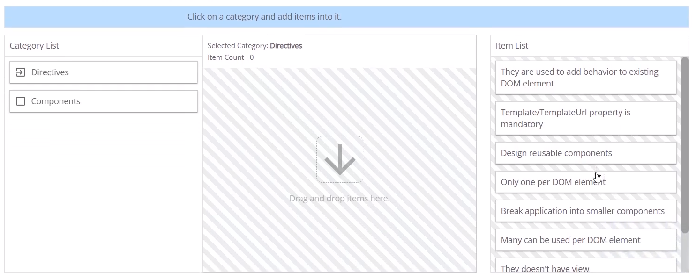

# Angular Web Developer Certification Quiz Questions

Test your Angular knowledge with these 30 challenging questions. Each question includes the code snippet and the correct answer with explanation.

## <h1 align="center">Introduction</h1>

**Question 1:** Which of the following statements are true regarding Angular change detection? [Select any 2]

<details> <summary><b>🔍 View Answer</b></summary>
✅ Answer:<br><br>

<p align="center">
✔️ Change detection algorithm is generated whenever every component is initialized<br>
✔️ Zones detects all asynchronous actions at run time
</p>

</details>

**Question 2:** Choose the appropriate statement(s) regarding Angular Command
Line Interface (CLI) [Select any three]

<details> <summary><b>🔍 View Answer</b></summary>
✅ Answer: <br><br>

<p align="center">
✔️ CLI comes with code generator that helps to generate skeletons of directives, services & component classes<br>
✔️ CLI comes with webpack pre configured for hassle free configuration<br>
✔️ CLI tool is generally much easier for an expert over a beginner (selected as the third, though it's subjective but acceptable in multiple-choice context)
</p>

</details>

**Question 3:** Tom, a front-end developer wants to update his Angular project to the latest Angular version. Suggest him the possible way.

<details> <summary><b>🔍 View Answer</b></summary>
✅ Answer: <p align="center">✔️ ng update @angular/cli @angular/core</p>

</details>

**Question 4:** Guess who is right from the below conversation.

Alex: It is mandatory to use Typescript in Angular

John: No, it's not mandatory to use TypeScript in Angular

<details> <summary><b>🔍 View Answer</b></summary>
✅ Answer: <p align="center">✔️ John</p>

</details>

**Question 5:** Which of the below feature helps in increasing the network performance of an Angular application?

<details> <summary><b>🔍 View Answer</b></summary>
✅ Answer: <p align="center">✔️ Lazy loading of modules</p>

</details>


## <h1 align="center">Components, Modules and Templates</h1>

**Question 1:** Which of the following will display "COVID19" when the angular applic ation loads in Browser?

<details> <summary><b>🔍 View Answer</b></summary>
✅ Answer:  <p align="center">✔️ {{("covid".toUpperCase()) + (10+9)}}</p>

</details>

**Question 2:** Choose the appropriate options that are true regarding an Angular components [Select any two]

<details> <summary><b>🔍 View Answer</b></summary>
✅ Answer: <br><br>

<p align="center">
✔️ Components are generally used to create UI widgets<br>
✔️ Components are used to break the application into smaller pieces of code
</p>

</details>

**Question 3:** Consider the below code:

```typescript
import { Component, OnInit} from '@angular/core';

@Component({

    selector: 'app-login',

    ----- Line 4 -----

    styleUrls: ['./login.component.css']

})

export class LoginComponent implements OnInit {

employeeName: string = "Nolan";

}
```
Which of the following is the correct option to write in Line 4 to print the message "Welcome Nolan"?

<details> <summary><b>🔍 View Answer</b></summary>
✅ Answer: <br><br>

```text
✔️ template: "<p>Hello {{employeeName}} </p>"
```

</details>

**Question 4:** 



<details> <summary><b>🔍 View Answer</b></summary>
✅ Answer: <br><br>

📂 Category: Directives<br>
Item Count: 4

(a) They don’t have a view <br>
(b) Only one Component per DOM element (implies Directives can be multiple)<br>
(c) Many can be used per DOM element<br>
(d) They are used to add behavior to existing DOM element

📂 Category: Components<br>
Item Count: 4

(a) Template/TemplateUrl property is mandatory<br>
(b) Break application into smaller components<br>
(c) Design reusable components<br>
(d) They are used to create UI widgets

</details>

**Question 5:** Identify the correct statements about modules in Angular application [Select any three]

<details> <summary><b>🔍 View Answer</b></summary>
✅ Answer: <br><br>

<p align="center">
✔️ Root Module must be loaded by default to launch the Angular application<br>
✔️ Imports property should contain all module classes to be used across application<br>
✔️ Angular application can be launched even without a root module (with standalone components in Angular 14+)
</p>

</details>


## <h1 align="center">Directives</h1>

**Question 1:** Consider the below code given in respective files of an angular application:

```typescript
/app.component.ts */

export class AppComponent {

newArr=[

{id: 101, name: "Alice", age: 23},

{id: 102, name: "Alex", age: 28),

{id: 103, name: "Bruno", age: 24),

{id:104, name: "Leo", age: 25},

]

}

<!-- app.component.html -->

<div *ngFor="let student of newArr">

<div *ngIf="student.age<25">{{student.name}}-{{student.age}}</div>

<div *ngIf="student.age>25">NA</div>
<div>
```
What will be the output rendered when the application loads in browser?

<details> <summary><b>🔍 View Answer</b></summary>
✅ Answer:  <p align="center">✔️ Alice-23 NA Bruno-24</p>

</details>

**Question 2:** Consider the below code given in app.component.ts file of an angular application:

```typescript
/app.component.ts */

import (Component } from '@angular/core';

@Component({

selector: 'my-app',

templateUrl: './app.component.html'

1)

export class AppComponent (

fruitlist ["apples", "oranges", "peaches"]
}
```
Which of the following code when written in app.component.html, would render the below output: (Select any two)

1.apples<br>
2.oranges<br>
3.peaches


<details> <summary><b>🔍 View Answer</b></summary>
✅ Answer: <br><br>

```text
✔️ <ol><li *ngFor="let fruit of fruitList; let i = index" >{{i+1}}.{{fruit}}</li></ol><br>
✔️ <div *ngFor="let fruit of fruitList:let i = index" >{{i+1}}.{{fruit}}<div>
```

</details>

**Question 3:** Consider the below requirement of Robert: He wants to write a code to change the background color of the text to yellow on hovering over the text. Which of the following is the correct option that he needs to write in Line 5 to achieve his requirement? His code looks like this:

```typescript
@Directive({ selector: '[appHighlight]'))

export class HighlightDirective (

------- Line 5 -------

}
```

<details> <summary><b>🔍 View Answer</b></summary>
✅ Answer: <p align="center">✔️ constructor(el: ElementRef) { el.nativeElement.style.backgroundColor = 'yellow'; }</p>

</details>

**Question 4:** Which of the following statements are true about ng-if?

<details> <summary><b>🔍 View Answer</b></summary>
✅ Answer: <br><br>

<p align="center">
✔️ ng-if removes the element from the DOM when the condition is false<br>
✔️ ng-if adds the element back to DOM if the condition turns true
</p>

</details>

**Question 5:** Which type of directives necessarily inject a DOM change whenever expression attached to it changes?

<details> <summary><b>🔍 View Answer</b></summary>
✅ Answer: <p align="center">✔️ Structural Directives</p>

</details>


## <h1 align="center">Data Binding</h1>

**Question 1:** What should be the code written at Line 1 such that Fruits button is disabled when it loads in browser?

```typescript
@Component({

selector: 'my-app",

template: cbutton

Line 1 >Fruits</button>"

})

export class AppComponent {

disableFruit: Boolean false;
}
```

<details> <summary><b>🔍 View Answer</b></summary>
✅ Answer:  <p align="center">✔️ [disabled]="disableFruit"</p>

</details>

**Question 2:** From the below code snippet, predict the cause of error if any.

```typescript
App.component.html

<table border=1>

<tr>
<td [colspan]="{{2+3}}">Hello</td>

<td>john</td>

</tr>

<tr>

<td >Hello</td>

<td>Michael</td>

</tr>

</table>
```

<details> <summary><b>🔍 View Answer</b></summary>
✅ Answer: <p align="center">✔️ Error due to incorrect attribute binding</p>

</details>

**Question 3:** Which is the correct statement to be placed in the template to hide the button based on the expression?

```typescript
@Component([

selector: 'my-app",

template: <button>Click me </button>"
})

export class AppComponent [

check: boolean true;
}
```

<details> <summary><b>🔍 View Answer</b></summary>
✅ Answer: <p align="center">✔️ [hidden]='check'</p>

</details>

**Question 4:** Identify the appropriate options below: [Select any two]

<details> <summary><b>🔍 View Answer</b></summary>
✅ Answer: <br><br>

```text
✔️ <input [ngModel]="employee.employeeName" (ngModelChange)="employee.employeeName = $event">
✔️ <input bindon-ngModel="employee.employeeName">
```

</details>


## <h1 align="center">Pipes and Forms</h1>

**Question 1:** Consider the below code as a custom validator to validate the value customerName form control.

[note: name should contain only alphabets]

```typescript
function validateName(name: FormControl) (

let value

Line-1

if (value.match( Line-2

)) return null

else return (error: true)

}
```

<details> <summary><b>🔍 View Answer</b></summary>
✅ Answer:  <p align="center">✔️ Line-1: name.value Line-2: /^[A-z]+$/</p>

</details>

**Question 2:** Which among the below is/are an invalid pipe format?

<details> <summary><b>🔍 View Answer</b></summary>
✅ Answer: <br><br>

```text
✔️ <p>{{ dob | date: 'month' }}</p>
```

</details>

**Question 3:** Which of the forms below are robust and more scalable in Angular Applications?

<details> <summary><b>🔍 View Answer</b></summary>
✅ Answer: <p align="center">✔️Reactive Driven Forms</p>

</details>

**Question 4:** Which among the following interpolation/s of dob will result in the below output where dob = Wed Jan 13 2021 14:06:25 GMT+0530 (India Standard Time)? [Select any two]

Output: Jan 13, 2021

<details> <summary><b>🔍 View Answer</b></summary>
✅ Answer: <br><br>

<p align="center">
✔️ {{dob | date}}<br>
✔️ {{dob | date: 'mediumDate'}}
</p>

</details>

**Question 5:** Which of the following is NOT a valid way of using date pipe:

<details> <summary><b>🔍 View Answer</b></summary>
✅ Answer: <p align="center">✔️{{today | date | 'long'}}</p>

</details>


## <h1 align="center">Component Communication & LifeCycle</h1>

**Question 1:** Which among the below is/are right approach for applying a font size of 20px to an element in Angular?[Select any three]

<details> <summary><b>🔍 View Answer</b></summary>
✅ Answer:  

```text
✔️ <p [style.fontSize.px]="20">First Styling</p>
✔️ <p [style.fontSize]="'20px'">Second Styling</p>
✔️ <p [ngStyle]="{fontSize: '20px'}">First Styling</p>
```

</details>

**Question 2:** Rearrange the steps to be followed when developing a reactive driven form:

A.Run the form app on browser<br>
B.Create formGroup<br>
C.Create template<br>
D.Add elements to formGroup

<details> <summary><b>🔍 View Answer</b></summary>
✅ Answer: <p align="center">✔️ CBDA</p>

</details>

**Question 3:** Predict the output of below code snippet.

```typescript
app.component.ts

import (Component) from "@angular/core";

@Component((

selector:

"my-app",

template:

<div>

<h3>Parent Component</h3>

<app-hello [property1]="parent Property"></app-hello>

</div>

))

export class AppComponent {

parentProperty = 'Cristiano Ronaldo';

}

hello.component.ts

import (Component, Input from "@angular/core";

@Component({

selector: "app-hello",

template: Hello...((childProperty | uppercase}}

})

export class HelloComponent {

childProperty 'Lionel Messi';

@Input() set property1(data: string) (

this.childProperty data;

}

}
```

<details> <summary><b>🔍 View Answer</b></summary>
✅ Answer: <p align="center">✔️ CRISTIANO RONALDO</p>

</details>

**Question 4:** Consider the below given code in respective files of an angular application:

```typescript
<!-- app.component.html -->

<input type="text" [(ngModel)]="course">

<button (click)="showCourse=true">Send Course</button>

<div *ngIf="showCourse">

<app-course_Line 1_></app-course>

</div>

/* app.component.ts */

course: string;

<!-- course.component.html -->

You have selected {{selectedCourse}}

/* course.component.ts */

@Input() /* Line 2*/
```
What should be written in Line 1 and Line 2 to send the value of course from app component (parent) tocourse component (child)?

<details> <summary><b>🔍 View Answer</b></summary>
✅ Answer: <p align="center">✔️ Line 1-[selectedCourse]="course" Line 2-selectedCourse</p>

</details>

**Question 5:** Which of the below property of view encapsulation helps in components styles to over-ride based on its sequence of selector?

<details> <summary><b>🔍 View Answer</b></summary>
✅ Answer: <p align="center">✔️ None</p>

</details>

**Question 6:** Which among the below statement/s is/are incorrect with respect to nested components?[Select any two]

<details> <summary><b>🔍 View Answer</b></summary>
✅ Answer:  <br><br>

<p align="center">
✔️ "Data is sent from parent component to child component always as an event"

✔️ "Only objects can be passed from parent component to child component"
</p>

</details>


## <h1 align="center">DI & Services</h1>

**Question 1:** Which of the following statements are true regarding Angular change detection? [Select any 2]

<details> <summary><b>🔍 View Answer</b></summary>
✅ Answer:  

(a) Change detection algorithm is generated whenever every component is initialized
(b) Zones detects all asynchronous actions at run time

</details>

**Question 2:** Choose the appropriate statement(s) regarding Angular Command
Line Interface (CLI) [Select any three]

<details> <summary><b>🔍 View Answer</b></summary>
✅ Answer: 

(a) CLI comes with code generator that helps to generate skeletons of directives, services & component classes
(b) CLI comes with webpack pre configured for hassle free configuration
(c) CLI tool is generally much easier for an expert over a beginner (selected as the third, though it's subjective but acceptable in multiple-choice context)

</details>

**Question 3:** Tom, a front-end developer wants to update his Angular project to the latest Angular version. Suggest him the possible way.

<details> <summary><b>🔍 View Answer</b></summary>
✅ Answer: ng update @angular/cli @angular/core

</details>

**Question 4:** Guess who is right from the below conversation.

Alex: It is mandatory to use Typescript in Angular

John: No, it's not mandatory to use TypeScript in Angular

<details> <summary><b>🔍 View Answer</b></summary>
✅ Answer: John

</details>

**Question 5:** Which of the below feature helps in increasing the network performance of an Angular application?

<details> <summary><b>🔍 View Answer</b></summary>
✅ Answer: Lazy loading of modules

</details>


## <h1 align="center">Routing</h1>

**Question 1:** Which of the following statements are true regarding Angular change detection? [Select any 2]

<details> <summary><b>🔍 View Answer</b></summary>
✅ Answer:  

(a) Change detection algorithm is generated whenever every component is initialized
(b) Zones detects all asynchronous actions at run time

</details>

**Question 2:** Choose the appropriate statement(s) regarding Angular Command
Line Interface (CLI) [Select any three]

<details> <summary><b>🔍 View Answer</b></summary>
✅ Answer: 

(a) CLI comes with code generator that helps to generate skeletons of directives, services & component classes
(b) CLI comes with webpack pre configured for hassle free configuration
(c) CLI tool is generally much easier for an expert over a beginner (selected as the third, though it's subjective but acceptable in multiple-choice context)

</details>

**Question 3:** Tom, a front-end developer wants to update his Angular project to the latest Angular version. Suggest him the possible way.

<details> <summary><b>🔍 View Answer</b></summary>
✅ Answer: ng update @angular/cli @angular/core

</details>

**Question 4:** Guess who is right from the below conversation.

Alex: It is mandatory to use Typescript in Angular

John: No, it's not mandatory to use TypeScript in Angular

<details> <summary><b>🔍 View Answer</b></summary>
✅ Answer: John

</details>

**Question 5:** Which of the below feature helps in increasing the network performance of an Angular application?

<details> <summary><b>🔍 View Answer</b></summary>
✅ Answer: Lazy loading of modules

</details>