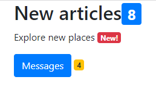

# Creating Responsive Web Pages using Bootstrap 4 Quiz Questions

Test your Responsive Web Pages using Bootstrap 4 knowledge with these 20 challenging questions. Each question includes the code snippet and the correct answer with explanation.

**Question 1:** Select the correct statement from the options below

<details> <summary><b>🔍 View Answer</b></summary>
✅ Answer:<br><br>

<p align="center">
✔️ 'navbar-dark' class displays light text<br>
✔️ 'navbar-light' class displays dark text
</p>

</details>

**Question 2:** Analyze the below code and select the appropriate option:

```typescript
<div class="col-md-8" style="background-color:grey">
  <h2>Buttons</h2>
  <div class="col-md-5" style="background-color:green">
     <button type="button" class="btn btn-primary btn-block">Button 1</button>
  </div>
  <button type="button" class="btn btn-primary btn-block">Button 2</button>
</div>
```

<details> <summary><b>🔍 View Answer</b></summary>
✅ Answer: <br><br>

<p align="center">
✔️ Button 1 is placed within the green div<br>
✔️ Button 2 is placed within the grey div
</p>

</details>

**Question 3:** Observe the below code and identify the correct option for Jack to add a thumbnail image after the heading:

```typescript
<div>
<h3>Welcome to Paris!</h3>
&blank_line 1_____________
</div>
```

<details> <summary><b>🔍 View Answer</b></summary>
✅ Answer: <br><br>

```text
✔️ 
```

</details>

**Question 4:** What is the default layout of the Bootstrap form?

<details> <summary><b>🔍 View Answer</b></summary>
✅ Answer: <br><br>
<p align="center">✔️ vertical</p>

</details>

**Question 5:** Which of the following class in Bootstrap is used to add a zebra-stripe to a table?

<details> <summary><b>🔍 View Answer</b></summary>
✅ Answer: <br><br>

<p align="center">
✔️ .table-bordered
</p>

</details>

**Question 6:** Analyze the below code and select the appropriate option:

```typescript
<div class="container">
	<h2>Responsive images</h2>
    <p>Lorem, ipsum dolor sit amet consectetur adipisicing elit. Sequi officiis porro itaque rem molestiae? Necessitatibus
          reiciendis harum vitae. Deserunt, suscipit</p>
  
</div>
```

<details> <summary><b>🔍 View Answer</b></summary>
✅ Answer: <br><br>

<p align="center">
✔️ The entire div is responsive. All components inside the div will realign with the browser on resizing.
</p>

</details>

**Question 7:** Does Bootstrap grid system work across multiple devices?

<details> <summary><b>🔍 View Answer</b></summary>
✅ Answer: <br><br>
<p align="center">
✔️ True
</p>

</details>

**Question 8:** Bootstrap package includes:

<details> <summary><b>🔍 View Answer</b></summary>
✅ Answer: <br><br>
<p align="center">
✔️ All the above
</p>

</details>

**Question 9:** There is a page that contains a navbar, an image, and a table.<br><br>

The table and image are made responsive using appropriate bootstrap classes.<br><br>

Which bootstrap class will resize the navbar into vertically stacked links on small screens?

<details> <summary><b>🔍 View Answer</b></summary>
✅ Answer:  <br><br>
<p align="center">✔️ navbar-expand-sm</p>

</details>

**Question 10:** In the given code, the image is already responsive. Which bootstrap class should be added in which line to make the table responsive and to make the image appear as a circle?

```typescript
<div> <!--line 1-->
      <table class="table"> <!--line 2-->
           <tr>
                <th>Department</th>
           </tr>
           <tr>
                <td>Arts</td>
                <td>Civil</td>
                <td>Science</td>
           </tr>
     </table>
      <!--line 10-->
</div>
```

<details> <summary><b>🔍 View Answer</b></summary>
✅ Answer: <br><br>

<p align="center">
✔️ line 1: table-responsive, line 10: rounded-circle
</p>

</details>

**Question 11:** Analyze the code given below for a form and select all options that apply:

```typescript
<form action="/action_page.php">
    <div class="form-check-inline">
      <label class="form-check-label">
        <input type="checkbox" class="form-check-input">Option 1
      </label>
    </div>
    <div class="form-check-inline">
      <label class="form-check-label">
        <input type="checkbox" class="form-check-input">Option 2
      </label>
    </div>
    <div>
      <label class="form-check-label">
        <input type="checkbox" class="form-check-input">Option 3
      </label>
    </div>
    <div class="form-check-inline">
      <label class="form-check-label">
        <input type="checkbox" class="form-check-input">Option 4
      </label>
    </div>
</form>
```

<details> <summary><b>🔍 View Answer</b></summary>
✅ Answer: <br><br>

<p align="center">
✔️ Checkboxes 1 and 2 are inline. Checkboxes 3 and 4 are vertically aligned below Checkbox 1
</p>
</details>

**Question 12:** Which of the following is correct about the Bootstrap Grid System?

<details> <summary><b>🔍 View Answer</b></summary>
✅ Answer: <br><br>

<p align="center">
✔️ >All the above
</p>

</details>

**Question 13:** Andrew wants to add badges to his code as shown in the image. Help him to choose the correct option:<br><br>

<br>

```typescript
<div class="container">
  <h2>New articles</h2>
  <p>Explore new places</p>
  <button type="button" class="btn btn-primary">Messages</button>
</div>
```
Choose the correct statements from the options below.

<details> <summary><b>🔍 View Answer</b></summary>
✅ Answer: <br><br>

<p align="center">
✔️ a badge must be affixed inside the button tag
</p>

</details>

**Question 14:** Which among these is the proper way of including badge within the button?

```typescript
[Option A] 
<input type="button" class="btn btn-primary" value="Submit"><span class="badge">20</span>

[Option B] 
<button class="btn btn-primary">Submit<span class="badge">20</span></button>

[Option C] 
<input type="button" class="btn btn-primary">Submit<span class="badge">20</span>
```

<details> <summary><b>🔍 View Answer</b></summary>
✅ Answer: <br><br>
<p align="center">
✔️ Option B only
</p>

</details>

**Question 15:** Which of the following plugin is used to create a window that is displayed on top of the current page?

<details> <summary><b>🔍 View Answer</b></summary>
✅ Answer: <br><br>
<p align="center">
✔️ modal
</p>

</details>

**Question 16:** What is the output of the below code?

```typescript
<div class="text-secondary text-capitalize">Let’s sTudY HTML and CSS!</div>
```

<details> <summary><b>🔍 View Answer</b></summary>
✅ Answer:  <br><br>
<p align="center">
✔️ "Let's STudY HTML And CSS!" will be displayed in gray color
</p>

</details>

**Question 17:** Observe the below code:

```typescript
<div class="container">     
  <div class="row">
  <div class="col-md-6 offset-md-1" style="background-color:grey">Paragraph 1 <br> Paragraph 2 <br> Paragraph 3 </div>
  <div class="col-md-4 offset-md-1" style="background-color:beige">Paragraph 1</div>
    </div>
  </div>
</div>
```

<details> <summary><b>🔍 View Answer</b></summary>
✅ Answer: <br><br>

<p align="center">
✔️ The grey div will have 3 lines of text vertically aligned one below the other<br>
✔️ The grey div will have 3 lines of text vertically aligned one below the other
</p>

</details>

**Question 18:** What can you ascertain from the below code for a navbar?

```typescript
<nav class="navbar navbar-expand-md bg-dark navbar-dark">
```

<details> <summary><b>🔍 View Answer</b></summary>
✅ Answer: <br><br>
<p align="center">✔️ A dark navbar with dark text that displays links inside a menu on medium screens
</p>

</details>

**Question 19:** A developer must add 2 divs inside a row.<br><br>

Which combination of dimensions for Div 1 and Div 2 will fit the browser window without overflow?

<details> <summary><b>🔍 View Answer</b></summary>
✅ Answer: <br><br>

```text
✔️ <div class="col-md-2 offset-md-3">Div 1</div> <div class="col-md-4 offset-md-3">Div 2</div>
```

</details>

**Question 20:** Which of the following is correct about Bootstrap Media Query?

<details> <summary><b>🔍 View Answer</b></summary>
✅ Answer: <br><br>
<p align="center">✔️ Both options 1 and 2
</p>

</details>